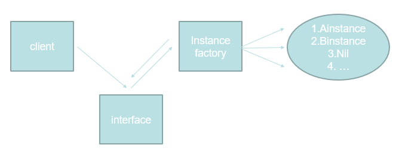

## 简单工厂模式 Simple Factory

在其他语言中会用NewXX函数来进行初始化类（在Go语言中没有类，只有结构struct），相当于构造函数，而简单工厂模式可以认为是NewXX函数返回接口的模式

Client（人民，外部调用） ---》 CellPhone（打电话呼救，interface）《---》 NewCall(警察局，调用合适警力，对该警号进行呼叫并返回)  《---》Call(警力，instance，接到通知就调用相应的方法）

