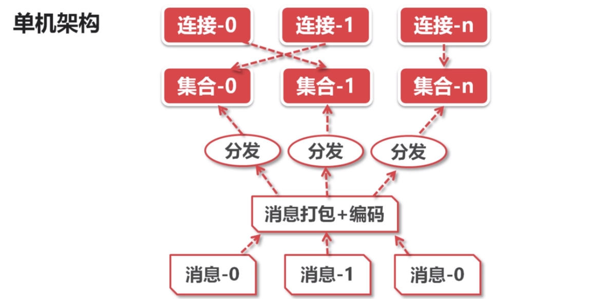
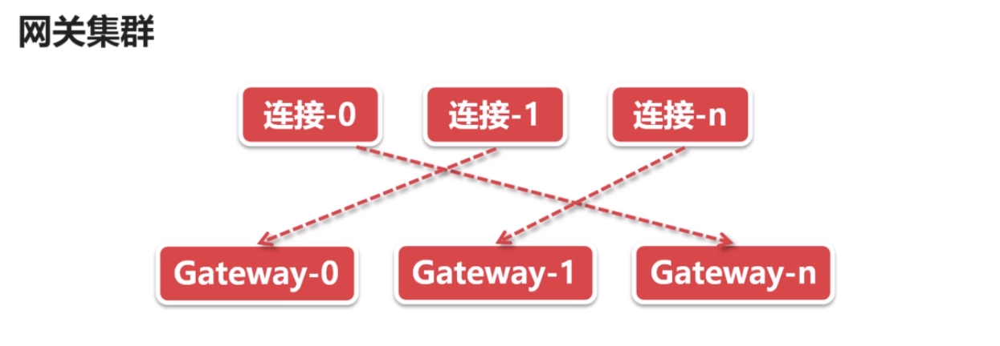
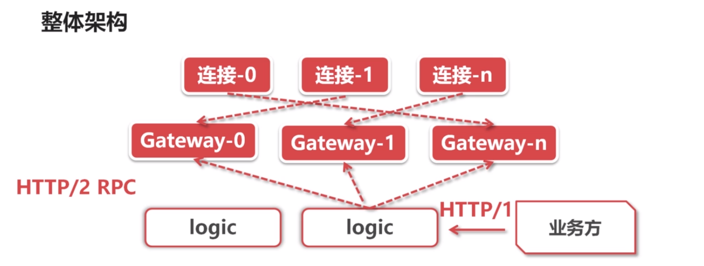

### Go实现千万级WebSocket消息推送服务
- 直播平台的弹幕实现原理
- 分布式高并发架构
- Go语言WebSocket开发
- Go语言开发模式与经验

### 技术点
- 弹幕系统的技术挑战
- 掌握WebSocket协议
- Go实现WebSocket服务端

### 弹幕业务复杂度
1个直播间
​	在线人数： 100 万
​	发送弹幕： 1000条/秒
​	推送频率： 100万 * 1000条/秒 = 10 亿条/秒

N个直播间
​	推送频率： N * 10 亿条/秒

### 拉模式与推模式 -- 消息模式
拉模式 -- Pull
> 是由客户器主动发起的事务。服务器把自己所拥有的信息放在指定地址（如IP、port），客户器向指定地址发送请求，把自己需要的资源“拉”回来。不仅可以准确获取自己需要的资源，还可以及时把客户端的状态反馈给服务器。

问题：

- 数据更新频率低，则大多数请求是无效的
- 在线用户数量多，则服务端的查询负载很高
- 定时轮询拉取，无法满足时效性要求

推模式 -- Push

> 是一种基于客户器/服务器机制、由服务器主动将信息送到客户器的技术。在push模式应用中，服务器把信息送给客户器之前，并没有明显的客户请求。push事务由服务器发起。push模式可以让信息主动、快速地寻找用户/客户器，信息的主动性和实时性比较好。
	优点：
	- 仅在数据更新时才需要推送
	- 需要维护大量的在线长连接
	- 数据更新后可以立即推送

基于WebSocket推送

- 浏览器支持的socket编程，轻松维持服务端的长连接
 - 基于TCP可靠传输之上的协议，无需开发者关心通讯细节
- 提供了高度抽象的编程接口，业务开发成本较低

### WebSocket协议与交互
1. 通讯流程 （握手确认连接，协议升级 TCP--> WebSocket）
	客户端---upgrade---> 服务端
	客户端<---switching--- 服务端
	客户端——msg——> 服务端
	客户端<——msg—— 服务端

2. 传输原理
	- 协议升级后，继续*复用*HTTP的*底层socket*完成后续通讯
	- message底层被切分成多个frame帧传输
	- 编程时只需要操作message，*无需关心frame*
	- 框架底层完成TCP网络I/O，WebSocket协议解析，开发者无需关心

3. 抓包观察
	- 使用chrome开发者工具，观察WebSocket通讯流程

### 服务端的技术选型与考虑
NodeJS

- 单线程模型，推送性能有限

C/C++

- TCP通讯、WebSocket协议实现成本高

Go

- 多线程，基于协程模型并发
 - 成熟的WebSocket标准库，无需造轮子

### Go实现WebSocket服务端
1. 实现HTTP服务端
	- WebSocket是HTTP协议Upgrade而来
	- 使用http标准库快速实现空接口： /ws
2.完成WebSocket握手
	- 使用WebSocket.Upgrader完成协议握手，得到WebSocket长连接
	- 操作WebSocket api，读取客户端消息，然后原样发送回去
3. 封装WebSocket
问题：
**缺乏工程化的设计**
- 其他代码模块，无法直接操作WebSocket连接
- WebSocket连接非线程安全，并发读/写需要同步手段
改进：
**隐藏细节，封装API**
- 封装Connection结构，隐藏WebSocket底层连接
- 封装Connection的API，提供Send/Read/Close等线程安全接口
**API原理**：
- SendMessage将消息投递到out channel
- ReadMessage从in channel读取消息
**内部原理**：
- 启动读协程，循环读取WebSocket，将消息投递到in channel
- 启动写协程，循环读取out channel，将消息写给WebSocket

### 千万级弹幕系统的架构秘密
分析技术难点
1. 3个性能瓶颈
- 内核瓶颈
	- *推送量大* ： 100万在线 * 10条/秒 = 1000万条/秒
	- *内核瓶颈*：Linux内核发送TCP的极限包频 ≈ 100万/秒
- 锁瓶颈
	- 需要维护在线用户集合（100万在线），通常是一个字典结构
	- 推送消息即*遍历整个集合*，顺序发送消息，耗时极长
	- 推送期间，客户端仍旧正常上/下线，所以集合*需要上锁*
- CPU瓶颈
	- 浏览器与服务端通常采用json格式通讯
	- json编码非常耗费CPU资源
	- 向100万在线推送1次，则需100万次json encode
2. 技术难点的解决方案
- 内核瓶颈 - 优化原理
  - 减少网络小包的发送
- 内核瓶颈 - 优化方案
  - 将同一秒内的N条消息，合并成1条消息
  - 合并后，每秒推送次数只等于在线连接数
- 锁瓶颈 - 优化原理
  - 大拆小
- 锁瓶颈 - 优化方案
  - 连接打散到多个集合中，每一个集合有自己的锁
  - 多线程并发推送多个集合，避免锁竞争
  - 读写锁取代互斥锁，多个推送任务可以并发遍历相同的集合
- CPU瓶颈 - 优化原理
  - 减少重复计算
- CPU瓶颈 - 优化方案
  - json编码前置，1次消息编码 + 100万次推送
  - 消息合并前置，N条消息合并后只编码1次

单机架构

### 了解布式架构
单机瓶颈
 - 维护海量长连接会花费不少内存
  - 消息推送瞬时消耗大量CPU资源
  - 消息推送瞬时带宽高达400~600MB（4-6Gbits），是主要瓶颈！！

网关集群

逻辑集群
 - 基于HTTP/2协议向gateway集群分发消息
     - *HTTP/2支持连接复用，用作RPC性能更佳*
- 基于HTTP/1协议对外提供推送API
  - *HTTP/1更加普及，对业务更加友好*

整体架构

