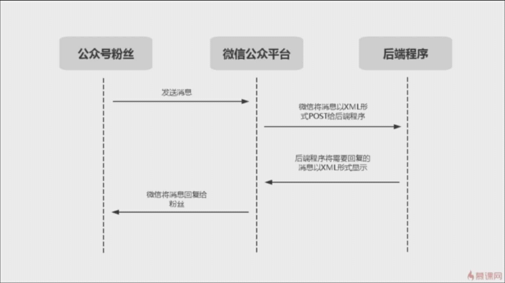

## GO语言微信公众号开发学习

### 公众号的基本逻辑

- 订阅号 -- 如果不是自媒体，还是不要选择了
- 服务号 -- 品牌或企业首选，可自定义二维码带参数、网页授权等功能
- 微信认证 -- 如果有认证的条件，一定要认证，哪怕只是资质认证 
- 微信公众号平台：https://mp.weixin.qq.com/
- 微信开放平台：https://open.weixin.qq.com/

### 公众号消息交互

### 开始一个Web应用

- 为什么不依赖框架？
- 如何处理路由？

微信公众号开发的一些注意事项：如服务器请求响应时间，日志输出，wxSDK的编写，默认回复

### 完成公众号URL + Token验证

- 解析请求中的GET参数

- 微信公众号验证签名的方法

- 可以用ngrok工具进行内网穿透进行测试

  - ngrok http -region ap 8081 把本机地址映射到公网地址

- 微信公众号平台

  - 基本配置
    - 开发者ID
      - AppID
      - AppSecret（注意保密）
    - 服务器配置
      - URL：域名
      - Token：自定义随机字符串
      - EncodingAESKey，消息加密密钥
      - 消息加密方式

  - 程序生命周期

    - 只收到一次来自微信服务器的get请求，是在微信公众号中设置域名的时候提交完毕后会直接发出get请求，注意在配置前开启服务器

      - 注意返回微信发过来的签名回复的字符串Echostr，用来验证签名（可不验证，但不建议）
    - 其余的都为post请求

### 接收并解析微信消息

- 获取请求中的POST数据  用ioutil.ReadAll获取请求数据体
- 利用第三方包解析XML mxj.NewMapXml(body)把xml数据解析成map
- 根据微信文档了解XML个字段含义

### 回复信息

- 哪些消息可以被回复   阅读微信文档
- 理解Go的struct的tag
- 利用Go的原生XML包生成XML     replyXml, err := xml.Marshal(reply)
- 注意事项 

### 脚本测试模仿用户访问公众号

测试方法

- 微信开发者工具在线测试的环境
- 接到公众号后端进行服务器配置后真实测试

问题：

- 性能和效率上比较差
- 对测试结果的监听和日志控制很难做到

解决方法 -- 自己写脚本进行测试

- 接收命令行参数
- 发起一个HTTP请求
- 解析请求结果
- 模拟微信签名

### 扩展程序

- 可扩展处理消息的类型
- 编写插件，编写rpc服务 https://github.com/weixinhost/yar.go
- 解析xml 第三方包 http://github.com/clbanning/mxj